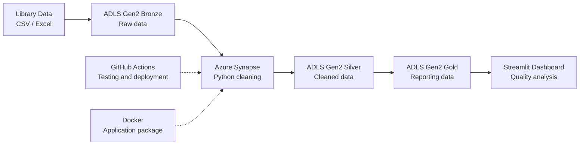

# Library Data Quality Architecture

## Project aim

The aim is to automate the library's data-quality analysis because manually checking the data takes too long and is less reliable.

## Technology choices

- **CSV and Excel:** Used because library data is commonly supplied in these formats.
- **Azure Data Lake:** Used because it can separate raw, cleaned and reporting-ready data.
- **Python and Pandas:** Used because they can automate cleaning, filtering and validation.
- **Azure Synapse:** Used because my company already uses Synapse and I am familiar with it.
- **GitHub Actions:** Used because it automatically runs the tests whenever code is pushed.
- **Docker:** Used because it packages the application and its dependencies together.
- **Streamlit:** Used because it provides a simple and free way to present the cleaned data.
- **Batch processing:** Used because the report does not require real-time updates.

## Outcome

The application reduces manual effort, improves consistency and produces repeatable results that are ready for presentation.